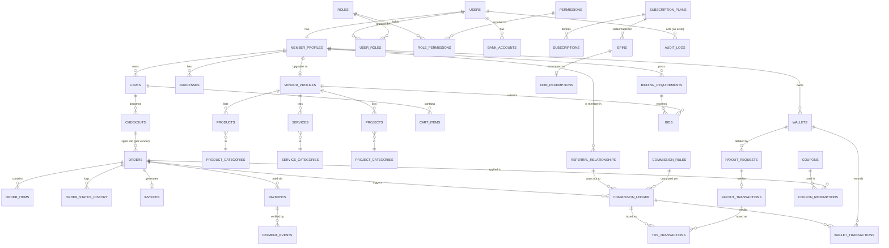

# Just Reference — Database Design & ERD (Phase 0)

Database: PostgreSQL 15+ (Supabase). ORM: Prisma ([ADR-0001](adr/0001-orm-choice.md)). This document is the authoritative entity list for Phase 1; the actual `prisma/schema.prisma` is generated from it during Phase 1, not before.

## Conventions

- Primary keys: `uuid` (`gen_random_uuid()` / Prisma `cuid()`—decide in Phase 1 kickoff; either is fine, must be consistent).
- All tables: `created_at`, `updated_at` (`timestamptz`). Mutable business tables also get `deleted_at` (soft delete) **except** ledger/audit tables, which are never deleted.
- Money columns: `bigint`, integer paise, **never** `numeric`/`float`/`decimal` for a value that is added or compared. Paired with `currency char(3) default 'INR'`. See [Money model](#money-model).
- Every foreign key is indexed. Every table that is filtered by "which member/vendor does this belong to" has an index on that column, since row-level authorization checks (`resource ownership`) run on every request.
- Status columns are `text` constrained by a Postgres `CHECK` against the enum values in [architecture.md §6](architecture.md#6-cross-cutting-mechanisms), not a Postgres native `enum` type (native enums are painful to extend later; a `CHECK` constraint can be altered without a type migration).

---

## Entity groups

### 1. Identity & access

| Table | Purpose | Key fields | Notes |
|---|---|---|---|
| `users` | One row per person/account (Supabase Auth `auth.users.id` is the PK) | `id`, `email`, `phone`, `status` (`ACTIVE/BLOCKED/PENDING_VERIFICATION`), `email_verified_at`, `phone_verified_at` | Auth identity only — no business/profile fields here |
| `member_profiles` | The "member" business identity — every user gets exactly one | `user_id` (FK, unique), `member_id` (public display code, e.g. `JR-000482`), `referral_code` (public, unique), `referral_path` (`ltree`, see [Referral tree model](#referral-tree-model)), `referred_by_user_id` (nullable FK), `dob`, `pan` (masked at API boundary), `gstin`, `kyc_status` | `referral_code` defaults to `member_id` per Q-32's suggested default ("Member ID is a display ID"; login is by email/mobile) |
| `addresses` | Residence / office / billing addresses | `owner_user_id`, `type` (`RESIDENCE/OFFICE/BILLING`), standard address fields | One user can have many |
| `bank_accounts` | Payout bank details | `user_id`, `account_no_masked`, `account_no_encrypted`, `ifsc`, `branch_address`, `verified_at` | Raw account number stored encrypted at rest (pgcrypto or app-layer AES-GCM); only masked form ever leaves the service layer except to `FINANCE`/`SUPER_ADMIN` |
| `vendor_profiles` | Vendor capability, 1:0..1 with `member_profiles` | `member_profile_id` (FK, unique), `business_name`, `approval_status` (`PENDING/APPROVED/REJECTED/SUSPENDED`), `approved_by`, `approved_at` | A member applies → admin approves → `VENDOR` role granted (Q-31) |
| `roles` | Static role catalog | `code` (`SUPER_ADMIN`, `ADMIN`, `FINANCE`, `SUPPORT`, `VENDOR`, `CUSTOMER`) | Seed data, not user-editable |
| `permissions` | Static permission catalog | `code` (e.g. `wallet:withdraw`) | Seed data; see [rbac.md](rbac.md) for the full list |
| `role_permissions` | Default permission set per role | `role_id`, `permission_id` | Editable by `SUPER_ADMIN` (Q-30: admin sub-roles as permission sets) |
| `user_roles` | Which roles a user actually holds | `user_id`, `role_id`, `granted_by`, `granted_at` | Many-to-many — a user can hold `CUSTOMER` + `VENDOR` together |
| `otp_verifications` | OTP challenge records (email/mobile/WhatsApp) | `user_id` (nullable, pre-signup), `channel`, `destination_masked`, `code_hash`, `expires_at`, `consumed_at`, `attempt_count` | Raw OTP is **never** persisted — only its hash; rate-limited per destination |
| `sessions` (delegated) | Supabase Auth manages session/JWT storage | — | We do not duplicate this table; `users.id` = `auth.users.id` |

### 2. Catalog

| Table | Purpose |
|---|---|
| `product_categories`, `product_subcategories` | Product taxonomy |
| `products` | `vendor_id`, `category_id`, `subcategory_id`, `title`, `description`, `sku`, `price` (paise), `stock`, `status` (`DRAFT/PENDING_APPROVAL/APPROVED/REJECTED/ARCHIVED`) |
| `product_images` | `product_id`, `storage_path`, `sort_order` |
| `service_categories`, `service_subcategories`, `services`, `service_images` | Mirror of product tables; `services.pricing_type` (`FIXED/QUOTE` — Q-24) |
| `project_categories`, `project_subcategories`, `projects` | `projects.cost` (paise), `advance_amount`, `balance_amount`, `terms`, `status` (workflow states, see [architecture.md](architecture.md)) |
| `project_images`, `project_documents` | Attachments |
| `project_milestones` | Optional milestone breakdown — schema present, **not activated in UI** until Q-23 (escrow/milestones) is confirmed |

Category/subcategory/listing tables are shared between the Admin panel and Vendor/Customer panels per the brief — enforced by putting all catalog mutation behind one `catalog` service module regardless of which panel calls it, with the permission check (`product:create` vs `product:approve`) determining what each caller may do, not separate code paths.

### 3. Cart, orders, checkout

| Table | Purpose |
|---|---|
| `carts`, `cart_items` | One open cart per user; `cart_items` can reference products, services, or projects (`item_type` + `item_id`, no single FK — see note below) |
| `checkouts` | One row per checkout attempt; groups the vendor-split orders it produced (Q-27: multi-vendor cart → one order per vendor) |
| `orders` | `checkout_id`, `vendor_id`, `buyer_id`, `status`, `subtotal`, `discount_total`, `tax_total`, `platform_fee_total`, `grand_total` (all paise) |
| `order_items` | `order_id`, `item_type`, `item_id`, `title_snapshot`, `unit_price_snapshot`, `qty`, `line_total` | Snapshotted at order time — catalog price changes never alter a placed order |
| `order_vendor_groups` | Kept as an explicit table (not just a `vendor_id` on `orders`) so a future "one platform-level shipment/tracking view across a multi-vendor checkout" feature doesn't require a schema change |
| `order_status_history` | Append-only log of every state transition, `from_status`, `to_status`, `actor_id`, `reason` | Feeds order tracking UI and audit |

*Note on `item_type` polymorphism:* products/services/projects are structurally different enough (stock vs. quote vs. milestone) that a single `line_items` table with a type discriminator is preferred over three separate order-item tables — it keeps invoice generation and cart logic uniform. Referential integrity to the specific catalog table is enforced at the application layer plus a `CHECK (item_type IN ('PRODUCT','SERVICE','PROJECT'))`, since Postgres has no native polymorphic FK.

### 4. Payments & invoicing

| Table | Purpose |
|---|---|
| `payments` | `order_id` (nullable — also used for wallet top-up/e-pin purchase), `provider` (`RAZORPAY`), `provider_order_id`, `provider_payment_id`, `amount`, `status` (`CREATED/AUTHORIZED/CAPTURED/FAILED/REFUNDED`), `idempotency_key` (unique) |
| `payment_events` | Raw webhook payloads received, `event_id` (unique, from provider), `signature_valid`, `processed_at` | Append-only; never trust a payment state change that didn't originate from a row here |
| `payment_transactions` | Normalized ledger of money movement per payment (capture, refund) tying back to `payments` | Distinct from `payment_events` (raw) so reporting doesn't have to parse provider JSON |
| `invoices` | `order_id`, `invoice_number` (sequential, gapless per financial-year — see [business-rules.md](business-rules.md) Q-19), `buyer_snapshot`, `vendor_snapshot`, `gst_total`, `platform_fee`, `grand_total`, `pdf_storage_path` |
| `invoice_items` | Line-level GST/HSN breakdown snapshot |

### 5. Referral & commission

| Table | Purpose |
|---|---|
| `referral_relationships` | `member_id`, `referrer_id`, `level` (1 = direct), `created_at`, `changed_by`/`changed_at` (nullable — only `SUPER_ADMIN` may repoint, per Q-05) | Authoritative parent-of-record |
| `referral_closure` *(or `ltree` path — see below)* | Precomputed ancestor/descendant pairs for O(1) tree reads | Maintained by a trigger/service on `referral_relationships` insert; **never** written directly by request handlers |
| `commission_rules` | Versioned, `level`, `rate_basis` (`PERCENT_OF_ORDER/PERCENT_OF_VENDOR_SALE/PERCENT_OF_PLATFORM_FEE/FIXED`), `rate_value`, `applies_to` (`PRODUCT/SERVICE/PROJECT/EPIN/SUBSCRIPTION/...`), `qualifying_event`, `effective_from`, `effective_to`, `created_by` | No rate is hardcoded anywhere else in the system (Q-02) |
| `commission_ledger` | Immutable, `member_id`, `source_order_id`, `rule_id`, `level`, `amount`, `status` (`PENDING/RELEASED/REVERSED`), `release_after` (computed from Q-06's return-window rule) | One row per commission event; reversal is a **new** row with `status=REVERSED`, never an update |

### 6. Wallet

| Table | Purpose |
|---|---|
| `wallets` | `owner_user_id` (unique), `balance` (paise, **derived** — see below), `pending_balance`, `wallet_pin_hash` (nullable, Q-13) |
| `wallet_transactions` | Immutable, `wallet_id`, `direction` (`CREDIT/DEBIT`), `amount`, `type` (`TOPUP/COMMISSION/PAYOUT/REFUND/REWARD/TRANSFER/ADJUSTMENT`), `reference_type`, `reference_id`, `idempotency_key` (unique), `balance_after` |
| `wallet_ledger` | Same event stream as `wallet_transactions`, kept as a distinct table matching the brief's explicit entity list, used for reconciliation/export; in Phase 1 implementation this may be collapsed into one table with a `ledger` view — **implementation detail deferred to Phase 1**, not a Phase 0 decision |

`wallets.balance` is **never** updated by `wallet.balance += amount`. Every mutation is: `INSERT wallet_transactions (...)` inside a `SERIALIZABLE` (or `SELECT ... FOR UPDATE` row-locked) transaction that also updates `wallets.balance` to the new computed value in the same statement/transaction, so the stored balance is always reconcilable by summing `wallet_transactions` for that wallet. A scheduled reconciliation job re-sums the ledger and alerts on drift.

### 7. Payout

| Table | Purpose |
|---|---|
| `payout_requests` | `wallet_id`, `amount`, `status` (`REQUESTED/APPROVED/REJECTED/PROCESSING/PAID/FAILED`), `requested_by`, `approved_by` (must differ from `requested_by` per Q-12's "second person" default), `bank_account_id` |
| `payout_transactions` | Actual transfer record (manual bank transfer reference number in Phase 1, per Q-12's default; automated-payout-provider fields present but unused until confirmed) |

### 8. E-pin & subscription

| Table | Purpose |
|---|---|
| `subscription_plans` | `code`, `type` (`YEARLY/TIME_BOUND/LIFETIME`), `price`, `duration_days` (nullable for lifetime), `benefits_json`, `active` |
| `subscriptions` | `member_id`, `plan_id`, `starts_at`, `expires_at` (nullable), `status` |
| `epins` | `code_hash` (never store the raw code — see [security.md](security.md)), `code_last4` (for support lookup/masking), `plan_id`, `status` (`FRESH/USED/EXPIRED/REVOKED`), `generated_by`, `price` |
| `epin_redemptions` | `epin_id`, `redeemed_by`, `redeemed_at`, `resulting_subscription_id` |

### 9. Coupons & rewards

| Table | Purpose |
|---|---|
| `coupons` | `code`, `discount_type` (`PERCENT/FIXED`), `value`, `min_order_amount`, `starts_at`, `expires_at`, `usage_limit`, `usage_limit_per_member` |
| `coupon_redemptions` | `coupon_id`, `member_id`, `order_id`, `amount_discounted` |
| `rewards` | Catalog of reward definitions (`CASH/COUPON/OTHER`) — **trigger rules unconfirmed, Q-08** |
| `reward_transactions` | Ledger of rewards actually granted, mirrors the wallet-ledger immutability pattern |

### 10. Tax / TDS

| Table | Purpose |
|---|---|
| `tds_rules` | Versioned: `section`, `rate`, `threshold_amount`, `no_pan_rate`, `effective_from`, `effective_to` | Populated only once the client's CA confirms (Q-18) |
| `tds_transactions` | Per deduction event, `member_id`, `source_ledger_ref`, `rule_id`, `amount_deducted`, `deducted_at_stage` (`CREDIT`/`PAYOUT`, per Q-18) |
| `tds_reports` | Generated period reports (for member self-view and admin export) |

### 11. Bidding *(schema present, payment settlement deliberately unplugged — Q-25)*

| Table | Purpose |
|---|---|
| `bidding_requirements` | `posted_by`, `title`, `description`, `budget_hint`, `status` (`OPEN/CLOSED/AWARDED/CANCELLED`) |
| `bids` | `requirement_id`, `vendor_id`, `amount`, `sealed_until` (bids hidden from each other until close), `status` (`SUBMITTED/ACCEPTED/REJECTED`) |

An accepted bid is designed to hand off into `orders`/`payments` via the same checkout pipeline once a payment model is confirmed — no separate payment path is built for bids.

### 12. Messaging, support, notifications, content

| Table | Purpose |
|---|---|
| `internal_messages` | `sender_id`, `recipient_id`, `body`, `read_at` — admin↔vendor/member per Q-35's confirmed-broader scope |
| `support_tickets`, `support_messages` | `ticket_number`, `status`, `priority`, threaded messages |
| `notifications` | `user_id`, `type`, `payload_json`, `read_at`, `channel` (`IN_APP/SMS/EMAIL`) |
| `feedback` | Member feedback form submissions (Q-35) |
| `blogs`, `blog_posts` | Admin-authored only in Phase 1 (Q-36) |
| `advertisements`, `banners` | Home-page banners set by admin (Q-34's "advertisement" clarification) |

### 13. Platform, settings, audit

| Table | Purpose |
|---|---|
| `system_settings` | Key-value(+type) store for tunables that aren't financial rules (idle-logout minutes, welcome-letter channel, etc.) |
| `maintenance_settings` | Maintenance-mode flag + message, who/when enabled |
| `audit_logs` | Immutable: `actor_id`, `action`, `entity_type`, `entity_id`, `before_json`, `after_json`, `ip`, `user_agent`, `created_at` |
| `webhook_events` | Cross-provider idempotency ledger (Razorpay, MSG91) — see [architecture.md §6](architecture.md#6-cross-cutting-mechanisms) |
| `files` / `documents` | Generic attachment registry for anything not covered by a dedicated `*_images`/`*_documents` table (KYC uploads, project docs) |

---

## Referral tree model

**Decision:** store the referral tree using PostgreSQL's `ltree` extension rather than a recursive CTE or a fully separate closure table.

- `member_profiles.referral_path ltree` — e.g. a member whose referrer's path is `jr.00042` gets `jr.00042.00117`.
- GiST index on `referral_path` makes "all descendants of X" a single indexed query: `WHERE referral_path <@ 'jr.00042'`, and "all ancestors of X" a single query against the path string — both O(log n), no recursion, no per-request tree walk.
- `referral_relationships` remains the authoritative direct-parent record (audit trail of who-referred-whom, including the Q-05 "referrer can only be changed by Super Admin" rule); `referral_path` is a derived, trigger-maintained projection of it, rebuilt for a subtree only when a repoint happens (rare, admin-only, already gated).
- This supports **unlimited depth**, so the still-open Q-01 ("is indirect exactly level 2, or unlimited?") does not force a schema change either way — the commission engine simply decides, per `commission_rules.level`, how many levels of the path to pay out on.

## Money model

- Every monetary column: `bigint` paise + `currency char(3) default 'INR'`. No `float`/`double` anywhere in the schema, no client-supplied amount is ever trusted (all order/commission/payout amounts are recomputed server-side from source rows).
- Every balance-affecting table (`wallet_transactions`, `commission_ledger`, `tds_transactions`, `reward_transactions`, `payout_transactions`) is **insert-only** at the schema level — no `UPDATE`/`DELETE` grants on these tables for the application's runtime DB role; corrections are always a new offsetting row, giving a permanent, replayable audit trail. This is enforced with a Postgres `REVOKE UPDATE, DELETE` on those tables for the app role, not just application discipline.
- All financial writes that touch more than one ledger (e.g., "order paid → wallet credit → commission ledger entries") run inside a single Prisma `$transaction` at `Serializable` isolation, or use `SELECT ... FOR UPDATE` on the wallet row, to eliminate concurrent double-credit/double-withdraw races.

## Indexing & constraints checklist (applied per table at Phase 1 schema time)

- FK columns indexed.
- `UNIQUE` on: `users.email`, `users.phone`, `member_profiles.member_id`, `member_profiles.referral_code`, `payments.idempotency_key`, `wallet_transactions.idempotency_key`, `webhook_events.(provider, event_id)`, `invoices.invoice_number`.
- `CHECK (amount >= 0)` on all ledger insert amounts (direction encodes sign via `direction` column, not a signed amount — avoids sign-flip bugs).
- `CHECK (balance >= 0)` on `wallets.balance` **unless** a specific negative-balance-permitted flow is explicitly confirmed (none currently — Q-07 explicitly says "no negative balance; recover from future earnings").

## ERD (entity-relationship overview, by subsystem)

*(This is a subsystem-level ERD for review purposes — the full column-level DDL is produced as `prisma/schema.prisma` in Phase 1, generated directly from the tables above so there is no drift between this document and the implementation.)*
