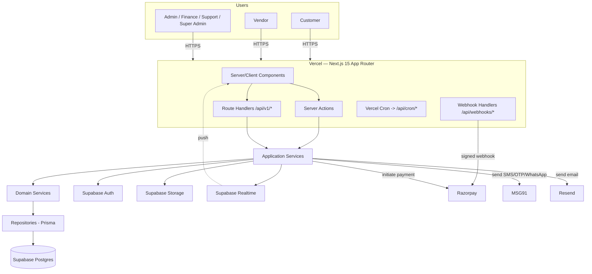
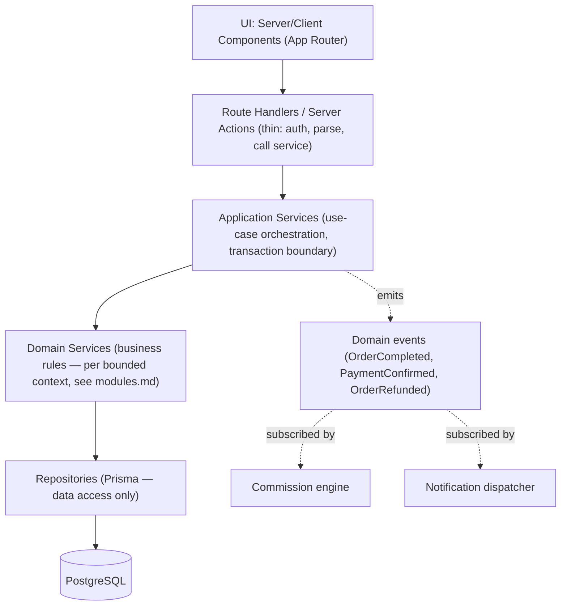
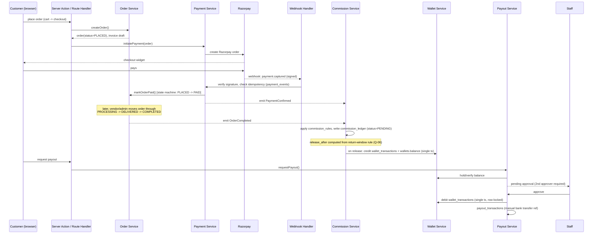
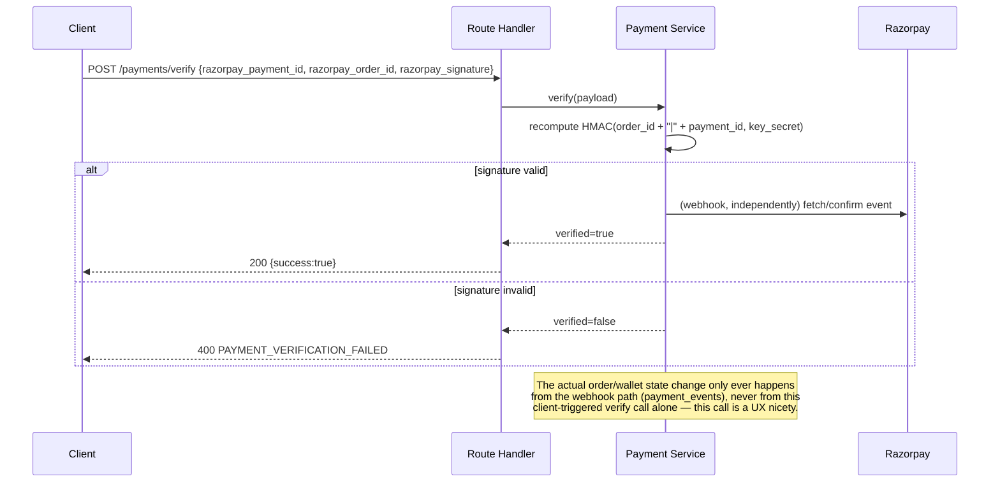
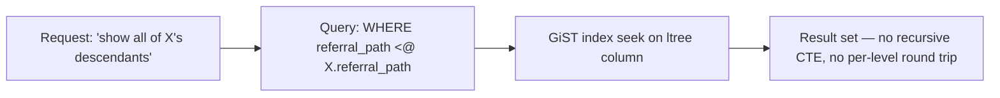

# Just Reference — High-Level Architecture Diagrams (Phase 0)

Companion to [architecture.md](architecture.md). Detailed ERD lives in [database.md](database.md); this document covers system-context, component, and key sequence diagrams.

## 1. System context

## 2. Component / layering view

This is the same rule stated in [architecture.md §2](architecture.md#2-layering-rule-mandatory) — the diagram exists so a reviewer can see the boundary at a glance: nothing above the "Application Services" line is allowed to contain money math or wallet/commission writes.

## 3. Order → Payment → Commission → Wallet → Payout sequence

Full state-transition detail lives in [financial-ledger.md](financial-ledger.md); this is the message-flow view.

## 4. Payment verification (server-side, never client-trusted)

## 5. Referral tree read path (no recursion)

See [ADR-0003](adr/0003-referral-tree-model.md) and [database.md §Referral tree model](database.md#referral-tree-model).
