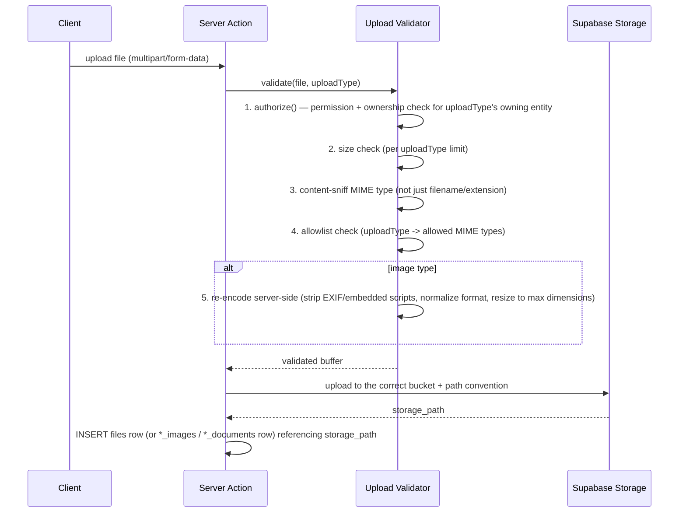

# Just Reference — File Upload Architecture (Phase 0)

Covers product/service/project images, KYC documents, project documents, banners/advertisements, and invoice PDFs. Expands [security.md](security.md) §4 (input validation) and references the `files` table in [database-tables.md §13](database-tables.md#13-platform-settings-audit).

## 1. Storage layout (Supabase Storage)

| Bucket | Visibility | Contents |
|---|---|---|
| `catalog-public` | Public read | Product/service/project images, banners, advertisements — served directly via CDN URL |
| `kyc-private` | Private, signed URL only | PAN/bank/KYC documents, project documents that may contain commercial terms |
| `invoices-private` | Private, signed URL only | Generated invoice PDFs |
| `blog-public` | Public read | Blog post images |

Bucket choice (public vs. private) is the first-line control — a KYC document is architecturally incapable of being served without a signed, permission-checked URL, independent of any application-layer bug.

## 2. Upload flow

## 3. Per-type rules

| Upload type | Max size | Allowed MIME | Bucket | Re-encoded? |
|---|---|---|---|---|
| Product/service/project image | 2 MB | `image/jpeg`, `image/png`, `image/webp` | `catalog-public` | Yes |
| KYC document (PAN, bank proof) | 5 MB | `image/jpeg`, `image/png`, `application/pdf` | `kyc-private` | Yes for images; PDFs are scanned but not re-encoded |
| Project document | 10 MB | `application/pdf`, `image/jpeg`, `image/png`, common office formats (`.docx`, `.xlsx`) — confirm with client if more is needed | `kyc-private` (same privacy tier) | Images only |
| Banner / advertisement | 300 KB (per the client's own content spec — no text embedded in the image) | `image/jpeg`, `image/webp` | `catalog-public` | Yes, includes a dimension check (1920×640 for banners) |
| Invoice PDF | server-generated, not user-uploaded | n/a | `invoices-private` | n/a |

## 4. Validation details

- **Content-sniffing, not extension trust:** the validator reads the file's magic bytes (e.g., via a library like `file-type`) to confirm the actual content matches the declared/allowed MIME type — a `.jpg`-named file containing an executable is rejected regardless of its extension.
- **Image re-encoding:** every accepted image is decoded and re-encoded server-side (e.g., via `sharp`) before storage. This strips EXIF metadata (which can carry GPS/device info — a minor privacy concern for KYC photos) and any embedded scripts/polyglot payloads, and normalizes dimensions/format. The **stored** file is never byte-identical to the uploaded file.
- **No client-side-only validation:** the client performs the same checks for fast UX feedback, but the server re-validates everything — the client check is a convenience, never a security boundary (same principle as [rbac.md](rbac.md) §1).
- **Filename handling:** original filenames are never used as storage paths (avoids path traversal and collision); storage paths are generated (`{bucket}/{ownerType}/{ownerId}/{uuid}.{ext}`) and the original filename, if needed for display, is stored as a separate column.

## 5. Access control

- Public bucket files are served via CDN URL — no permission check needed per-request (the data itself is meant to be public, e.g., a product photo).
- Private bucket files (KYC, invoices, project documents) are served **only** via a short-lived signed URL minted by a Route Handler that runs the full `authorize()` check (role + permission + ownership) before generating the URL — never a long-lived or guessable public path. Every signed-URL issuance for a KYC document is `audit_logs`-recorded (`action: 'KYC_DOCUMENT_ACCESSED'`), consistent with [security.md](security.md) §7's requirement that full KYC access is audited.

## 6. Malware-safety posture

Phase 1 does not integrate a dedicated malware/AV scanning service (not named in any source document); the layered mitigations are: strict MIME allowlisting, content-sniffing (not extension trust), mandatory re-encoding of all image uploads (which neutralizes most image-polyglot attack vectors by construction, since re-encoding discards anything that isn't valid pixel data), private-bucket isolation for anything not meant for public serving, and size limits to bound worst-case impact. If the client's eventual independent security test (per the Live Testing doc's go-live checklist) flags this as insufficient for the KYC document path specifically, adding a scanning step (e.g., an AV API call before the file is accepted) is a contained addition to the Upload Validator step in §2, not an architecture change.
