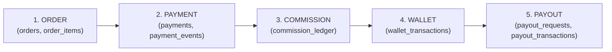

# Just Reference — Financial Ledger Architecture (Phase 0)

This is the authoritative explanation of how money moves through the system and how every step is recorded. It ties together [database-tables.md](database-tables.md), [ADR-0002](adr/0002-money-representation.md), and the module boundaries in [modules.md](modules.md). Read this before implementing any of `orders`, `payments`, `commission`, `wallet`, or `payout`.

## 1. Core invariant

**No balance is ever mutated without a corresponding immutable ledger row, written in the same database transaction.** `wallets.balance` and `wallet.pending_balance` are *cached projections* — the ledger (`wallet_transactions`) is the source of truth, and a scheduled job re-sums the ledger to catch any drift. The same pattern applies to `commission_ledger`, `tds_transactions`, `reward_transactions`, and `payout_transactions`: every one is insert-only, with `UPDATE`/`DELETE` revoked at the database-role level, not just avoided by convention.

## 2. The five stages: Order → Payment → Commission → Wallet → Payout

### Stage 1 — Order
- A checkout produces one `orders` row per vendor (see [database-tables.md §3](database-tables.md#3-cart-orders-checkout)), status `PLACED`, amounts computed server-side from `catalog` prices at that instant (snapshotted into `order_items`, never re-read live afterward).
- **State recorded by:** `order_status_history` gets a row for every transition (`from_status`, `to_status`, `actor_id`, `reason`) — this is the append-only audit trail for the order's lifecycle, independent of `orders.status` itself. See [ADR-0008](adr/0008-explicit-state-machines.md).
- No money has moved yet. `PLACED` does not imply paid.

### Stage 2 — Payment
- `payments` row created (`status=CREATED`) when checkout initiates a Razorpay order.
- Razorpay webhook arrives → signature verified → `payment_events` row inserted (unique on `(provider, event_id)`, so a replay is a no-op) → **only then** does `payments.status` move to `CAPTURED` and `orders.status` move `PLACED → PAID` (via the order state machine, which logs an `order_status_history` row with `actor_id = NULL` / a system actor, `reason = 'payment captured'`).
- **State recorded by:** `payment_events` (raw provider truth, append-only) + `payments.status` (current view) + `order_status_history` (the downstream effect on the order).
- See [payment-architecture.md](payment-architecture.md) for the full verification/webhook sequence.

### Stage 3 — Commission
- Order reaches `COMPLETED` (a later, separate transition — not the same as `PAID`; see [business-rules.md](business-rules.md) Q-06) → `orders` emits `OrderCompleted`.
- The commission engine (`commission` module) reads the active `commission_rules` for the order's item type, walks the payer's `referral_path` ancestors (via the `ltree` index — no recursive query, see [ADR-0003](adr/0003-referral-tree-model.md)), and for each eligible ancestor level, **inserts** a `commission_ledger` row: `status=PENDING`, `release_after` computed from the confirmed return-window rule.
- **Nothing is credited to any wallet yet.** `PENDING` commission is visible to the member (as "pending earnings") but is not spendable.
- **State recorded by:** `commission_ledger` insert per (member, order, level) — one row per payout leg, never a single aggregated row, so each can be independently reversed later.

### Stage 4 — Wallet
- A scheduled job (`/api/cron/release-commissions`) or an on-demand check finds `commission_ledger` rows where `status=PENDING AND release_after <= now()` and the source order hasn't been refunded/cancelled in the meantime.
- For each: within a single DB transaction —
  1. Row-lock (or `SERIALIZABLE`) the target `wallets` row.
  2. Insert `wallet_transactions` (`direction=CREDIT`, `type=COMMISSION`, `reference_type='COMMISSION_LEDGER'`, `reference_id=<commission_ledger.id>`, `idempotency_key` derived from the commission ledger row's id so re-running the job is a no-op).
  3. Update `wallets.balance += amount` (the **only** place this increment happens, and only inside this transaction).
  4. Update `commission_ledger.status = RELEASED` for the source row.
- **State recorded by:** `wallet_transactions` (immutable, one row per credit) + `commission_ledger.status` transition (which is itself audit-logged).

### Stage 5 — Payout
- Member requests a payout (`payout_requests`, `status=REQUESTED`) — server checks `wallets.balance >= amount` at request time (not a hard reservation; see §4 below for the concurrency-safe check at approval time).
- A **second person** (`approved_by != requested_by`, enforced by a `CHECK` constraint — Q-12) approves.
- On approval, inside a single transaction:
  1. Row-lock `wallets`.
  2. Re-verify `balance >= amount` (must re-check here, not just at request time — see §4).
  3. Insert `wallet_transactions` (`direction=DEBIT`, `type=PAYOUT`, `reference_type='PAYOUT_REQUEST'`, `reference_id=<payout_requests.id>`).
  4. Update `wallets.balance -= amount`.
  5. `payout_requests.status = APPROVED`.
- `FINANCE` then executes the actual bank transfer (manual in Phase 1, per Q-12's default) and records it in `payout_transactions` (`transfer_reference`, `tds_deducted` from the `tds-tax` module, `net_amount`, `paid_at`), setting `payout_requests.status = PAID`.
- **State recorded by:** `wallet_transactions` (the debit) + `payout_requests.status` history + `payout_transactions` (the settlement record) + `tds_transactions` (the deduction, inserted by the same transaction that finalizes `payout_transactions`).

## 3. State transition table (all five stages)

| Entity | Statuses | Who can trigger | Recorded in |
|---|---|---|---|
| `orders.status` | `PLACED → PAID → PROCESSING → SHIPPED/DELIVERED → COMPLETED`, with `CANCELLED`/`REFUNDED` reachable from earlier states | system (payment webhook), vendor, admin, customer (cancel only) — see [rbac.md](rbac.md) §4 | `order_status_history` (every transition) |
| `payments.status` | `CREATED → AUTHORIZED → CAPTURED / FAILED`, `CAPTURED → REFUNDED` | system only (webhook-driven) | `payment_events` (raw), `payments.status` (current) |
| `commission_ledger.status` | `PENDING → RELEASED`, `PENDING/RELEASED → REVERSED` (via a new offsetting row, not an update) | system (release job), `FINANCE`/`SUPER_ADMIN` (manual reversal on refund) | `commission_ledger` insert history (status is set once per row at creation or superseded by a new `reversal_of_id` row) |
| `wallets` balance | not a status — a derived number | never set directly; only changed by a `wallet_transactions` insert | `wallet_transactions` |
| `payout_requests.status` | `REQUESTED → APPROVED/REJECTED → PROCESSING → PAID/FAILED` | member (request), `FINANCE` (approve/reject — must differ from requester), `FINANCE` (record transfer) | `audit_logs` (every transition, mandatory per [security.md](security.md) §10) |

## 4. Concurrency safety

- **Double payout / concurrent withdrawals:** the balance re-check in Stage 5 step 2 happens *inside* the same row-locked transaction as the debit — two simultaneous payout approvals against the same wallet serialize on the row lock; the second one re-reads the now-lower balance and fails with `INSUFFICIENT_BALANCE` if it would go negative. This is the explicit test case in [testing.md](testing.md) §2.
- **Duplicate webhook:** `payment_events` unique constraint on `(provider, event_id)` makes a second delivery of the same event a no-op before any wallet/order write is attempted.
- **Refund after commission already released/withdrawn (Q-07):** refund triggers a **new** `commission_ledger` row (`status=REVERSED`, `reversal_of_id` pointing at the original) for the full original amount. If the corresponding `wallet_transactions` credit was already spent (withdrawn), the wallet is **not** forced negative (`wallets.balance CHECK >= 0` prevents it structurally) — instead, the reversal is recorded and a recovery flag is set so the shortfall is deducted from the member's **next** released commission, per the adopted default in [business-rules.md](business-rules.md) Q-07. This recovery-from-future-earnings logic lives in the `commission` service, not in the wallet debit itself, keeping the two modules' responsibilities separate (see [modules.md](modules.md) §8–9).

## 5. Why five stages, not one big transaction

Order placement, payment capture, commission release, and payout are **not** one atomic operation — they happen at different times (commission is deliberately deferred past a return window; payout is deliberately a separate member-initiated action). Each stage is its own transaction with its own ledger, connected by `reference_type`/`reference_id` pointers rather than a single sprawling transaction, so that:
- A failure or delay at one stage (e.g., the release job hasn't run yet) never blocks or corrupts an earlier stage's already-committed state.
- Each stage is independently auditable and independently testable (see [testing.md](testing.md) §1–2).
- The isolation required by the brief ("wallet logic isolated from payment UI," "referral logic isolated from order logic") is structural, not just a coding convention — each stage's write is owned by exactly one module.
