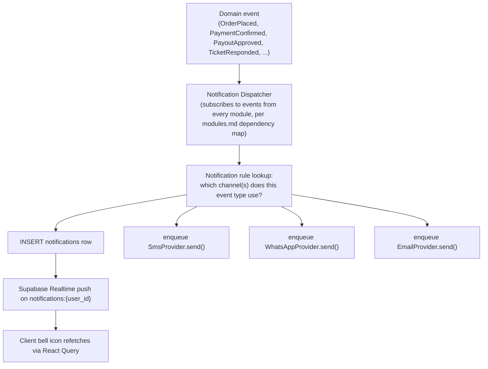

# Just Reference — Notification Architecture (Phase 0)

Covers the "bell icon," SMS/WhatsApp/email dispatch, and the welcome-letter/birthday-greeting flows from the brief. Complements [api.md §9](api.md#9-realtime-channels-supabase-realtime) (the realtime push mechanism) and [modules.md §15](modules.md#15-messaging-support).

## 1. Channels

| Channel | Provider | Used for |
|---|---|---|
| In-app (bell icon) | `notifications` table + Supabase Realtime push | Order status changes, payout decisions, commission released, ticket responses, admin broadcasts |
| SMS | MSG91 | OTP, critical account alerts (payout paid, security-relevant changes) |
| WhatsApp | MSG91 WhatsApp Business API | Sign-up verification code (Q-33); optionally mirrors selected SMS alerts if the client wants it |
| Email | Resend (fallback: Supabase SMTP) | Welcome letter, invoices, password reset, birthday greeting (Q-37 default channel) |

## 2. Delivery architecture



- The dispatcher is a single choke point (`src/server/domain/messaging/notify.ts`) — no module sends SMS/email/WhatsApp directly; every module emits a domain event and the dispatcher decides delivery, so channel rules (e.g., "which events go to WhatsApp") are configured in one place, not scattered across 15 modules.
- `notifications` (in-app) is written synchronously in the same request/transaction that caused it where feasible; SMS/WhatsApp/email are **queued**, not sent inline in the triggering request, since a third-party provider outage must never block an order/payment/commission transaction from committing.

## 3. Provider abstraction (matches [ADR-0006](adr/0006-auth-strategy.md)'s pattern)

```
interface SmsProvider { send(to: string, template: string, vars: Record<string,string>): Promise<DeliveryResult> }
interface WhatsAppProvider { send(to: string, template: string, vars: Record<string,string>): Promise<DeliveryResult> }
interface EmailProvider { send(to: string, template: string, vars: Record<string,string>): Promise<DeliveryResult> }
```

Concrete implementations (`Msg91SmsProvider`, `TwilioSmsProvider`, `ResendEmailProvider`, `SupabaseSmtpEmailProvider`) live in `src/server/lib/`, selected by environment configuration — matching the brief's "MSG91 or Twilio" / "Resend or Supabase SMTP" phrasing without hardcoding a single vendor into the domain layer.

## 4. Delivery tracking & idempotency

- Every outbound send is recorded (provider message ID, status, timestamp) so a support agent can answer "did this SMS actually go out" without guessing — this is the confirmed scope of the "SMS outbox" (Q-34: a **read-only delivery log**, not a compose/draft feature in Phase 1).
- MSG91/provider delivery-status callbacks land in `webhook_events` (generic cross-provider table, see [database-tables.md §13](database-tables.md#13-platform-settings-audit)) using the same idempotency pattern as Razorpay webhooks (unique on `(provider, event_id)`).
- Templates are versioned (a template ID + variables, not inline strings), so wording changes don't require a code deploy and every send can be traced to which template version was used.

## 5. Specific flows named in the brief

| Flow | Trigger | Channel(s) | Content |
|---|---|---|---|
| Welcome letter | `UserRegistered` | Email (primary) + in-app copy, per Q-37's adopted default | Date & time, name, email, mobile, Member ID, Referral ID (if applicable) |
| Birthday greeting | Daily cron scan of `member_profiles.dob` | Email, per Q-37's adopted default | — |
| OTP (signup/login) | User-initiated | SMS or WhatsApp, per the flow chosen | 6-digit code, 5-minute expiry (see [security.md](security.md) §2) |
| Order status change | `order_status_history` insert | In-app always; SMS/email for key transitions (paid, shipped/delivered, cancelled/refunded) — exact set TBD, not a blocker | Order number, new status |
| Payout decision | `PayoutApproved`/`PayoutRejected` | In-app + SMS (payout is money-moving, SMS ensures the member sees it even if they don't check the app) | Amount, status, reference |
| Commission released | `CommissionReleased` | In-app | Amount, level, source order |
| Support ticket response | `support_messages` insert | In-app + email | Ticket number, snippet |
| Admin broadcast / "dashboard like-tab" | Admin-composed | In-app, per Q-34's adopted default (graphic or non-graphic content in a dashboard feed) | Free-form |

## 6. What's explicitly not built (per [business-rules.md](business-rules.md))

- Member-composed SMS (full inbox/outbox/drafts/upload-doc) — Q-34, needs a real SMS provider connected and explicit scope confirmation; the read-only delivery log above is what ships by default.
- Automatic (rule-triggered) reward notifications — depends on Q-08's reward-trigger rules being defined first.
