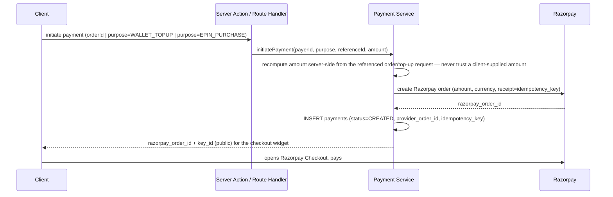
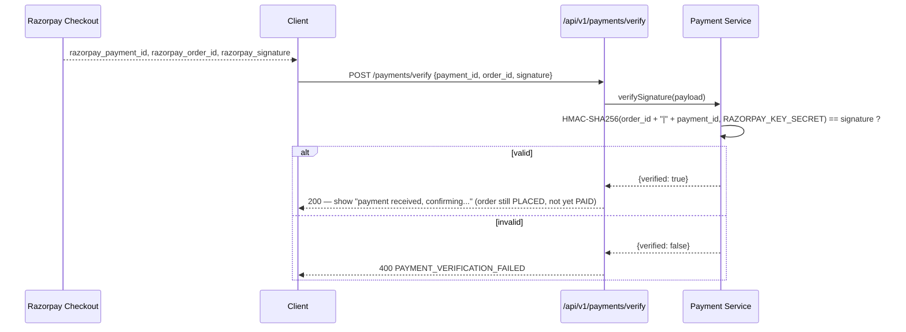
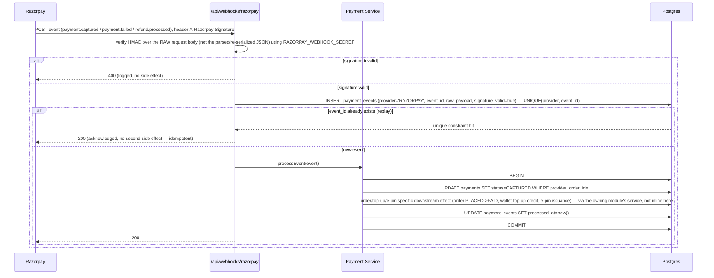
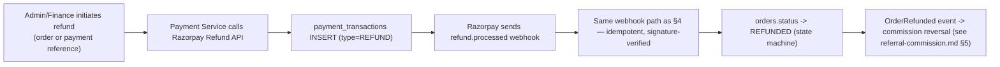

# Just Reference — Payment Architecture (Phase 0)

Razorpay integration detail, expanding [security.md](security.md) §5 and [financial-ledger.md](financial-ledger.md) Stage 2. Covers orders, wallet top-ups, e-pin/subscription purchases — every flow that calls Razorpay uses this same architecture.

## 1. Principle

The browser is a **notifier**, never a **source of truth**. It tells the server "the user attempted payment X and the checkout widget reported success" — the server independently confirms this via signature verification and, authoritatively, via the Razorpay webhook before any financial state changes.

## 2. Payment creation flow

## 3. Client-side callback (UX only, not authoritative)

This call **never** flips `orders.status` to `PAID` or writes to `wallet_transactions` — it only gives the client fast, honest UI feedback. The authoritative state change happens exclusively via §4.

## 4. Webhook processing (authoritative path)

Key points, each already stated as a rule elsewhere and repeated here because this is the highest-risk code path in the system:
- Signature verification uses the **raw** request body — re-serializing parsed JSON before verifying can silently change byte content and break HMAC matching, a common real-world bug class for webhook integrations.
- The unique constraint on `(provider, event_id)` is the idempotency mechanism, not an application-level "have I seen this before" check (which would itself have a race condition) — the database constraint is the one thing guaranteed to be atomic under concurrent delivery.
- The webhook handler returns 200 as soon as the event is durably recorded and processed, so Razorpay stops retrying; a 4xx/5xx here causes Razorpay to retry per its own schedule, which the idempotency handling above makes safe.

## 5. Refunds

Per the client's own status document, the gateway refund call-out is a production-build-stage task (Phase 4-equivalent), not a Phase 0/1 gap — the ledger-recording side (`payment_transactions`, the downstream `orders`/`commission` reaction) is designed and built regardless; only the literal Razorpay Refund API call is deferred to when live credentials exist.

## 6. Payment methods & scope (Q-28)

Razorpay online methods only (UPI, cards, net banking) — no cash-on-delivery in Phase 1, per the adopted default in [business-rules.md](business-rules.md) Q-28. Wallet-balance-as-payment-method is a separate, internal flow (debit `wallet_transactions` directly, no Razorpay call) gated on Q-09's confirmation that wallet balance may pay for orders.

## 7. Test coverage required (see [testing.md](testing.md) §2)

- Valid signature → processed once.
- Invalid signature → rejected, no side effect, logged.
- Duplicate webhook delivery (same `event_id`) → acknowledged, no second side effect.
- Out-of-order delivery (e.g., `refund.processed` arriving before the corresponding `payment.captured` was ever recorded) → handled gracefully, not assumed to arrive in order.
- Client claims success but no webhook ever arrives (e.g., user closes tab) → order remains `PLACED`, a reconciliation job periodically polls Razorpay for orders stuck in `CREATED`/`PLACED` past a timeout window and resolves them explicitly rather than leaving them ambiguous forever.
