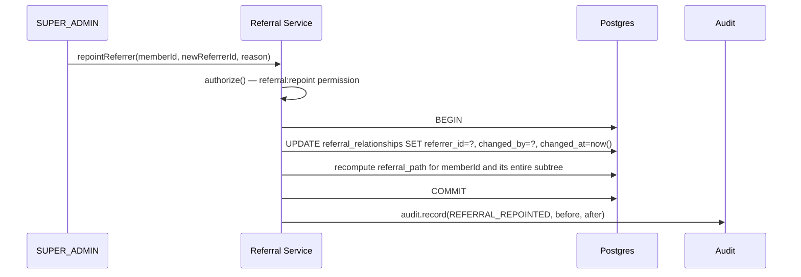
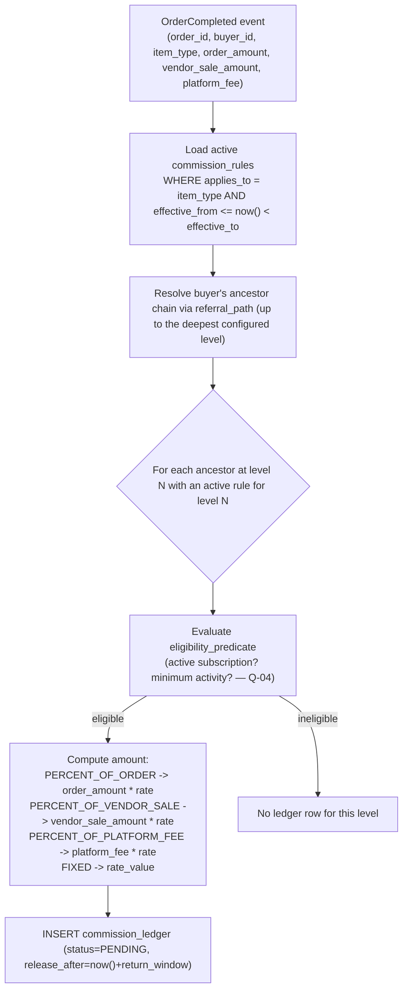
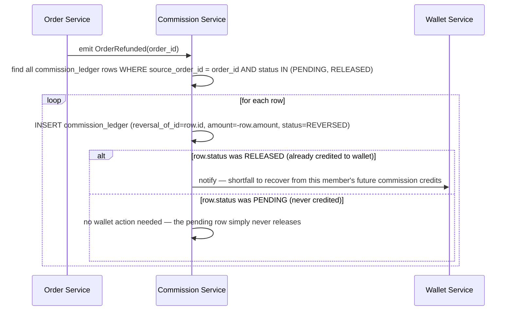

# Just Reference — Referral & Commission Architecture (Phase 0)

Companion to [financial-ledger.md](financial-ledger.md) §2 Stage 3 (which covers *when* commission is created/released) and [ADR-0003](adr/0003-referral-tree-model.md) (which covers *how the tree is stored*). This document covers the referral/commission engine's internal design.

## 1. Why referral and commission are separate modules

`referral` owns *who is related to whom*. `commission` owns *who gets paid how much, when*. They are deliberately separate ([modules.md](modules.md) §7–8) because the relationship between two members is permanent structural fact (subject only to a rare, audited Super Admin repoint — Q-05), while commission **rules** change over time (new rate, new qualifying event) without the underlying tree changing at all. Collapsing them would mean every rate change risks touching relationship data, and every relationship-repoint risks touching historical commission math — both are unacceptable for an auditable financial system.

## 2. Referral tree read path

```mermaid
flowchart TB
    A[New signup with referral code] --> B["referral service: validate code -> resolve referrer's member_profile"]
    B --> C["INSERT referral_relationships (member_id, referrer_id, level=1)"]
    C --> D["compute referral_path = referrer.referral_path || new_member.id"]
    D --> E["UPDATE member_profiles.referral_path"]
    E --> F[GiST index now supports O(log n) ancestor/descendant queries]
```

- A member's **direct** referrer is `referral_relationships.referrer_id` (the row where `member_id = self`).
- A member's **indirect** ancestors at any depth are read via `referral_path <@ ancestor.referral_path` (descendants) or by walking `referral_path`'s own segments (ancestors) — never a recursive CTE, never N+1 queries per level.
- The **number of paying levels** (Q-01) is a `commission_rules` configuration concern, not a tree-structure concern — the tree itself supports unlimited depth regardless of how many levels are actually activated for payout.

## 3. Repointing a referrer (Super Admin only, Q-05)



This is infrequent and explicitly gated — it is the **only** write path that mutates an existing `referral_relationships`/`referral_path` value, and it always produces an `audit_logs` entry with the before/after state (see [audit-logging.md](audit-logging.md)).

## 4. Commission calculation — inputs and flow



All arithmetic is integer paise (per [ADR-0002](adr/0002-money-representation.md)); rounding is round-half-up applied once, at the final paise, never compounded across levels.

## 5. Reversal on refund/cancellation (Q-07)



The wallet balance is never forced negative (`wallets.balance CHECK >= 0`). If a reversal exceeds what's still pending, the commission service tracks a recovery offset applied against the member's next `RELEASED` commission event, rather than the wallet service ever debiting below zero.

## 6. What's configurable vs. what's structural

| Configurable (via `commission_rules`, editable by `SUPER_ADMIN`/`FINANCE`-propose) | Structural (schema, does not change without a migration) |
|---|---|
| Number of paying levels | Unlimited-depth `ltree` tree |
| Rate per level, rate basis | Insert-only `commission_ledger` |
| Qualifying events | `PENDING → RELEASED → REVERSED` status set |
| Eligibility predicate (active subscription, minimum activity) | Referrer lock-at-signup + Super-Admin-only repoint |
| Release timing / return window | One ledger row per (member, order, level) |

This is the concrete mechanism behind the brief's requirement that "referral assignment rules must be configurable" and "do not hardcode commission percentage" — every number in this document that's still `TBD` in [business-rules.md](business-rules.md) is a **row**, not a constant, and can be changed by `SUPER_ADMIN` without a deploy once confirmed.
